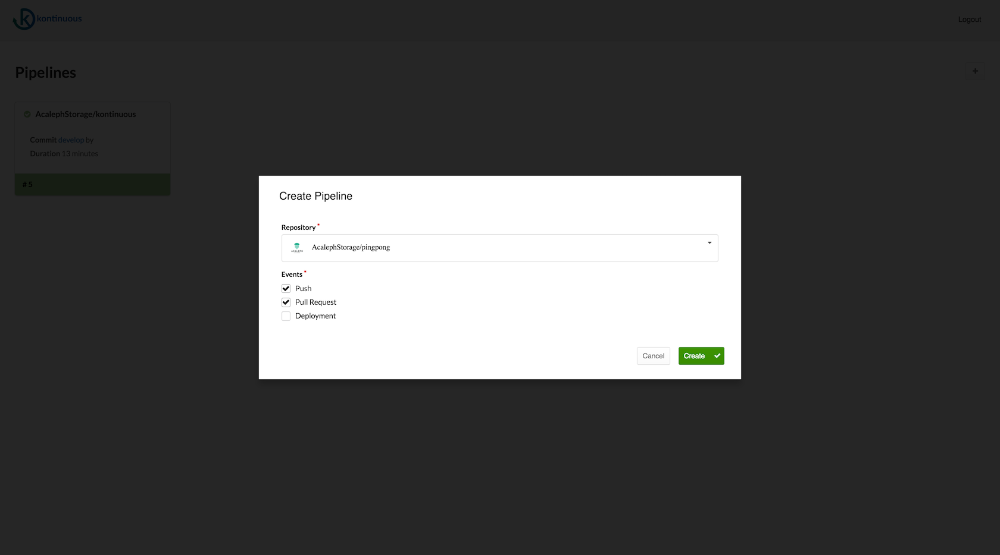
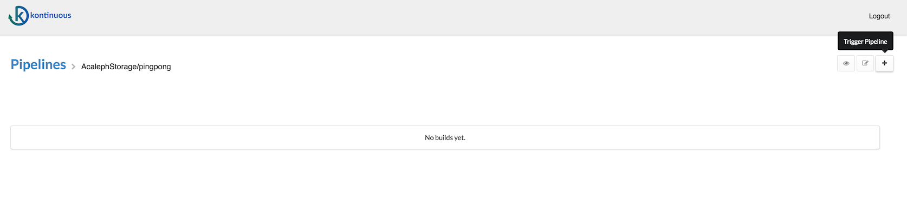
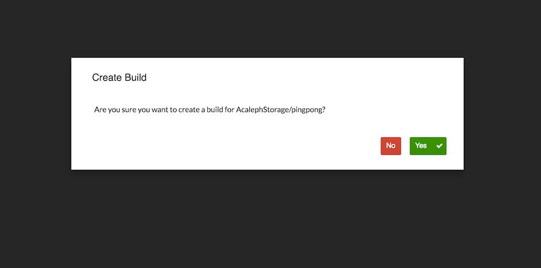
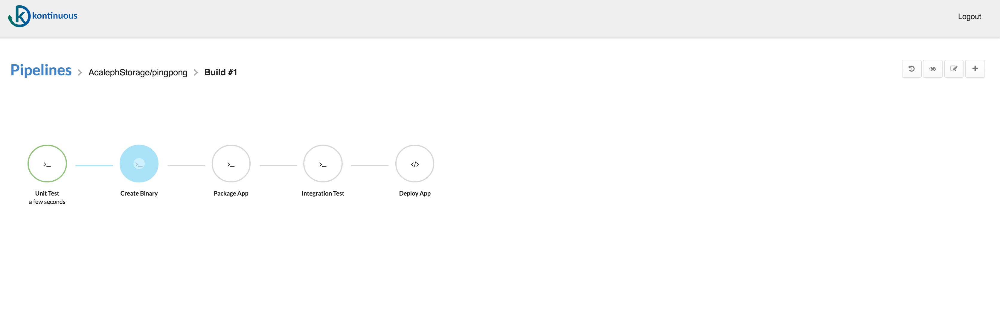
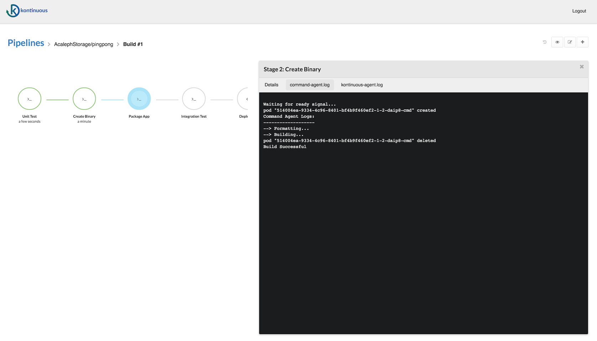
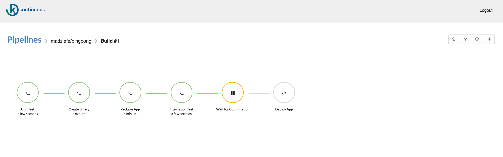
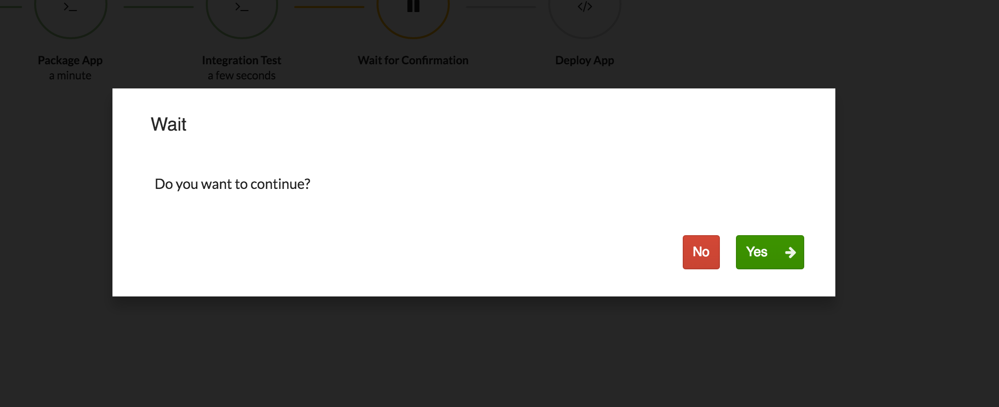
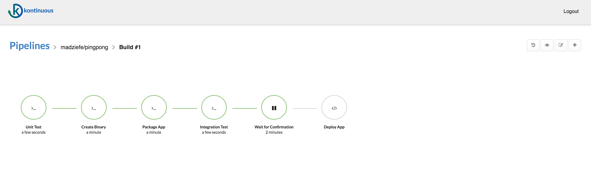

# Lab: Build a Continuous Deployment Pipeline with Kontinuous and Kubernetes

(http://kubernetes.io/docs/user-guide/walkthrough/).


In order to deploy the application with [Kubernetes](http://kubernetes.io/) you will use the following resources:
  - [Deployments](http://kubernetes.io/docs/user-guide/deployments/) - replicates our application across our kubernetes nodes and allows us to do a controlled rolling update of our software across the fleet of application instances
  - [Services](http://kubernetes.io/docs/user-guide/services/) - load balancing and service discovery for our internal services
  - [Ingress](http://kubernetes.io/docs/user-guide/ingress/) - external load balancing and SSL termination for our external service
  - [Secrets](http://kubernetes.io/docs/user-guide/secrets/) - secure storage of non public configuration information, SSL certs specifically in our case

## Prerequisites
1. A Google Cloud Platform Account
1. [Enable the Google Compute Engine and Google Container Engine APIs](https://console.cloud.google.com/flows/enableapi?apiid=compute_component,container)

## Do this first
In this section you will start your [Google Cloud Shell](https://cloud.google.com/cloud-shell/docs/) and clone the lab code repository to it.

1. Create a new Google Cloud Platform project: [https://console.developers.google.com/project](https://console.developers.google.com/project)

1. Click the Google Cloud Shell icon in the top-right and wait for your shell to open:

  

  

1. When the shell is open, set your default compute zone:

  ```shell
  $ gcloud config set compute/zone us-east1-d
  ```

1. Clone the lab repository in your cloud shell, then `cd` into that dir:

  ```shell
  $ git clone https://github.com/GoogleCloudPlatform/continuous-deployment-on-kubernetes.git
  Cloning into 'continuous-deployment-on-kubernetes'...
  ...

  $ cd continuous-deployment-on-kubernetes
  ```

##  Create a Kubernetes Cluster
You'll use Google Container Engine to create and manage your Kubernetes cluster. Provision the cluster with `gcloud`:

```shell
$ gcloud container clusters create jenkins-cd \
  --num-nodes 3 \
  --scopes "https://www.googleapis.com/auth/projecthosting,storage-rw"
```

Once that operation completes download the credentials for your cluster using the [gcloud CLI](https://cloud.google.com/sdk/):
```shell
$ gcloud container clusters get-credentials jenkins-cd
Fetching cluster endpoint and auth data.
kubeconfig entry generated for jenkins-cd.
```

Confirm that the cluster is running and `kubectl` is working by listing pods:

```shell
$ kubectl get pods
```
You should see an empty response.


## Install Kontinuous


1. Download binary. [here](https://github.com/AcalephStorage/kontinuous/releases)
2. This will deploy Kontinuous API, Dashboard deployments and services.

 ```
    $ kontinuous-cli deploy --namespace {namespace} \
    --auth-secret {base64 encoded secret} \
    --github-client-id {github client id} \
    --github-client-secret {github client secret}

    ```
 For more information on KONTINUOUS [here.](https://github.com/AcalephStorage/kontinuous/blob/master/README.md)

## Create a pipeline
You'll now use Kontinuous to define and run a pipeline that will test, build, and deploy your copy of `gceme` to your Kubernetes cluster. You'll approach this in phases. Let's get started with the first.

### Phase 0. Pre-requisites

 1. Define config file.

	```
	Host: http://kontinuous-url
	Token: github-token
	Secret: base64-encoded-secret
   ```

 More details found [here](https://github.com/AcalephStorage/kontinuous/tree/master/cli)


### Phase 1. Create initial .pipeline.yml using Kontinuous-cli

A repository needs to define a pipeline spec by adding .pipeline.yml to the root directory of the repository.


```kontinuous-cli init <pipeline-name>``` . This will add .pipeline.yml in your repository.

`pipeline-name` = github owner / github repository name.  eg. `AcalephStorage/kontinuous`

More information on pipeline specification [here](https://github.com/AcalephStorage/kontinuous/blob/master/docs/pipeline.md#pipeline-specification)


### Phase 2. CI and CD with KONTINUOUS


#### Phase 2.1 Using Kontinuous CLI

1. Create Pipeline.

	`$ kontinuous-cli create pipeline <pipeline-name>`

1. Create Build.

	`$ kontinuous-cli create build <pipeline-name>`

1. Resume Build.

    ```$ kontinuous-cli resume <pipeline-name> -b <build-number>```


Available kontinuous-cli commands.

```
Usage:
  kontinuous-cli [global options] command [command options] [arguments...]

Commands:
  get pipelines     get all pipelines
  get repos         get all repositories
  get builds        get all builds of pipeline
  get stages        get the stages of a pipeline build
  create pipeline   create pipeline for repo
  create build      trigger pipeline build
  delete pipeline   delete pipeline
  delete build      delete build
  deploy remove     remove Kontinuous resources in the cluster
  init              create and save initial .pipeline.yml in your repository

```
#### Phase 2.2 Using Kontinuous Dashboard

1. Login to Kontinuous.
2. Create Pipeline

   

3. Create Build

   

   

   

   

4. Resume Build.

   

   

   

### Phase 3. Deployment.

Define pipeline deploy stage.

```
stage:
  name: Deploy To Kubernetes
  type: deploy
  params:
    deploy_dir: k8s/{{.KONTINUOUS_BRANCH}}

```

- `KONTINUOUS_BRANCH` = build current branch
- `deploy_dir` = contains all your application Kubernetes related resource files.

  [Namespaces, Deployments, ReplicationControllers, Services, etc]
- `deploy_file` = your application Kubernetes related resource text in `yaml` format.

More list on KONTINUOUS vars [here](https://github.com/AcalephStorage/kontinuous/blob/develop/docs/pipeline.md#vars)


### Phase 4. Deployment (Staging and Production).

To be supported on future releases.


### Phase 4. Cleaning Up

1. Delete Pipeline.
	-  `$ kontinuous-cli delete pipeline <pipeline-name>`

2. Delete Build.
	- ```$ kontinuous-cli delete build <pipeline-name> -b <build-number>```

